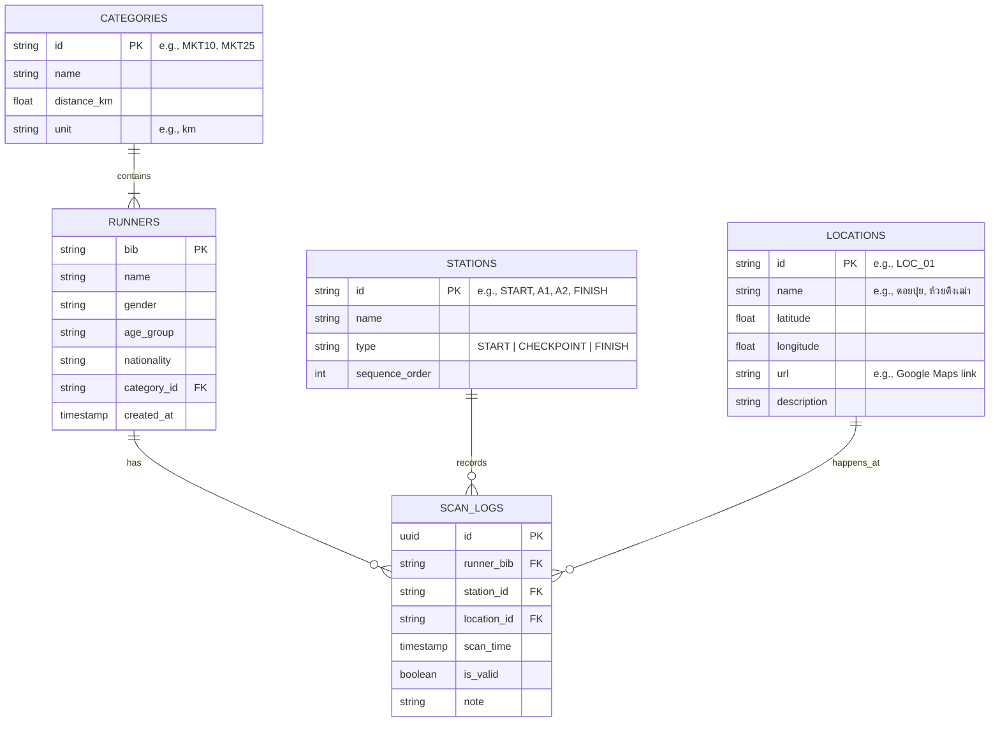

# Database Flow & Schema (TrailTime Race Timing System)

## 1. Entity Relationship Diagram (ERD)

## 2. Table Structures

### 2.1 `RUNNERS` (ข้อมูลนักวิ่ง)
เก็บข้อมูลส่วนตัวของนักวิ่งแต่ละคน โดยใช้หมายเลข `bib` เป็น Primary Key
- `bib` (VARCHAR/String, PK) - หมายเลขบิบ (เช่น "1001")
- `name` (VARCHAR) - ชื่อ-นามสกุล
- `gender` (VARCHAR) - เพศ (M/F)
- `age_group` (VARCHAR) - รุ่นอายุ (เช่น "20-29")
- `nationality` (VARCHAR) - สัญชาติ
- `category_id` (VARCHAR, FK) - รหัสระยะทางที่ลงแข่งขัน
- `created_at` (TIMESTAMP) - เวลาที่เพิ่มข้อมูลเข้าระบบ

### 2.2 `CATEGORIES` (ระยะการแข่งขัน)
เก็บประเภทหรือระยะทางการแข่งขัน
- `id` (VARCHAR, PK) - ตัวย่อระยะ (เช่น "MKT10", "PST50")
- `name` (VARCHAR) - ชื่อเต็มของระยะ
- `distance_km` (FLOAT) - ระยะทาง
- `unit` (VARCHAR) - หน่วยวัดระยะทาง (เช่น "km")

### 2.3 `LOCATIONS` (สถานที่จริง)
เก็บข้อมูลพิกัดและสถานที่ตั้งจริงของจุดเช็คพอยต์หรือพื้นที่จัดงาน
- `id` (VARCHAR, PK) - รหัสสถานที่
- `name` (VARCHAR) - ชื่อสถานที่ (เช่น "อุทยานแห่งชาติดอยสุเทพ", "ลานกางเต็นท์ห้วยตึงเฒ่า")
- `latitude` (FLOAT) - ละติจูดพิกัดแผนที่
- `longitude` (FLOAT) - ลองจิจูดพิกัดแผนที่
- `url` (VARCHAR) - ลิงก์แผนที่ (เช่น Google Maps)
- `description` (TEXT) - คำอธิบายเส้นทางหรือจุดสังเกต

### 2.4 `STATIONS` (จุดสแกนในระบบ)
เก็บจุด Check-in, Check Point, และ Finish Line ในเชิงโครงสร้างของการแข่งขัน
- `id` (VARCHAR, PK) - รหัสจุดสแกน (เช่น "START", "A1", "A2", "FINISH")
- `name` (VARCHAR) - ชื่อจุด (เช่น "A1 Mae Kha Nin")
- `type` (ENUM) - ประเภทของจุด (START, CHECKPOINT, FINISH)
- `sequence_order` (INT) - ลำดับของจุดสแกน (ใช้สำหรับตรวจสอบว่านักวิ่งข้ามจุดหรือไม่)

### 2.5 `SCAN_LOGS` (ประวัติการสแกน Check Point)
เก็บประวัติทุกครั้งที่เครื่องสแกนบาร์โค้ดอ่านค่าได้ (เป็น Transaction Table)
- `id` (UUID, PK) - รหัสรายการสแกน
- `runner_bib` (VARCHAR, FK) - บิบของนักวิ่งที่ถูกสแกน
- `station_id` (VARCHAR, FK) - จุดที่สแกน (อ้างอิง STATIONS)
- `location_id` (VARCHAR, FK) - สถานที่จริงที่ทำการสแกน (อ้างอิง LOCATIONS)
- `scan_time` (TIMESTAMP) - เวลาที่สแกน
- `is_valid` (BOOLEAN) - สแกนถูกต้องตามเงื่อนไขหรือไม่ (เช่น เช็คอินซ้ำ = false)
- `note` (VARCHAR) - หมายเหตุ (เช่น "ซ้ำ", "ยังไม่ผ่านจุดเริ่มต้น")

## 3. Data Flow (ลำดับการไหลของข้อมูล)

1. **Pre-race (ก่อนแข่ง):** 
   - ผู้จัดระบบ Import ข้อมูลนักวิ่งเข้าตาราง `RUNNERS`
   - ตั้งค่า `LOCATIONS` (สถานที่) และกำหนด `STATIONS` (จุดสแกน)
2. **Start (ปล่อยตัว):** 
   - นักวิ่งสแกนบิบที่จุด Start 
   - ระบบเพิ่ม Record ใน `SCAN_LOGS` (บันทึก `station_id` และ `location_id`)
3. **On Course (ระหว่างทาง):** 
   - นักวิ่งวิ่งผ่านจุด Checkpoint (A1, A2)
   - สแกนบิบ -> ระบบตรวจสอบว่ามี Log การสแกนที่ 'START' หรือยัง 
   - หากมีแล้ว -> เพิ่ม Record ใน `SCAN_LOGS` (พร้อมเก็บ `location_id` ปัจจุบัน)
4. **Finish (เข้าเส้นชัย):**
   - นักวิ่งสแกนบิบที่เส้นชัย 
   - ระบบเพิ่ม Record ใน `SCAN_LOGS` 
   - ดึงเวลาจาก Start และ Finish เพื่อคำนวณ Total Time สำหรับแสดงผลในหน้า Results
